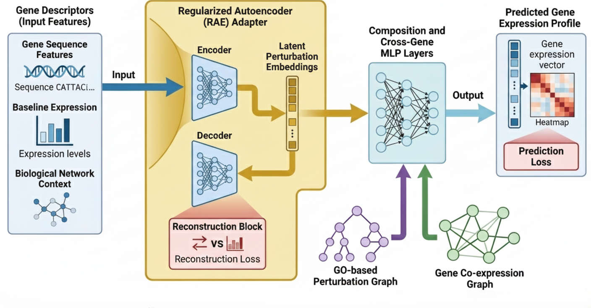

# DAPT

Welcome to the official documentation of Descriptor-based Adaptive Perturbation Transformer  (**DAPT**)!

## 📍 Overview & Motivation


.png)

Understanding how gene perturbations alter cellular transcriptional responses is central to modern biomedicine, enabling rational therapeutic design and the identification of genetic interactions. While recent single-cell CRISPR screening platforms like Perturb-seq provide large-scale datasets, existing computational methods exhibit instability when predicting multigene perturbations, particularly for genes unseen during training or entirely missing from biological knowledge graphs. 

We present DAPT, a novel deep learning framework designed to predict the transcriptional outcomes of single and multigene perturbations. Developed to overcome the structural limits of existing models. DAPT introduces a descriptor-driven perturbation adapter integrated with Graph Neural Networks (GNNs) and prior biological knowledge.

DAPT replaces standard ID-based perturbation embeddings with a descriptor-based representation. This allows our model to learn the intrinsic biological properties of genes, significantly improving zero-shot prediction for both unseen and out-of-vocabulary (OOV) perturbations.

## 💡 Key Innovations
- **Descriptor-Based Representation:** Replaces discrete, ID-based embeddings with semantic biological gene descriptors, enabling parameter sharing across genes.
- **Perturbation Regularized Autoencoder (RAE):** Transforms high-dimensional descriptors into dense latent embeddings through non-linear transformations. 
- **Biological Knowledge Integration:** Utilizes Gene Ontology (GO) and Gene Co-expression graphs as dense substrates for message passing, ensuring predictions are grounded in functional pathways.
- **OOV Generalization :** Generates perturbation representations directly from input descriptors, enabling out-of-distribution generalization, particularly for unseen or novel gene perturbations.

## 🚀 Quick Start
DAPT is designed to be flexible. You can interact with it visually through a web dashboard, or integrate it directly into your own bioinformatics scripts for high-throughput batch processing.

### 1. 🔗 Interactive Web Dashboard
The easiest way to experience DAPT is through our interactive web application—no installation required! For real-time inference and visual analysis of single and multigene perturbations in Norman et al. (2019) Perturb-seq dataset.

👉 **[Access the DAPT Web Dashboard Here](https://huggingface.co/spaces/NKH1701/DAPT)**

How to use the dashboard?<br>
1. Select a Task: Use the left sidebar to choose your experiment mode.<br>
2. Choose Target Genes: Select the specific genes you want to perturb from the dropdown menus.<br>
3. Run Inference: Click the **"Run DAPT Inference 🚀"** button to process the Co-expression and GO Graphs.<br>
4. Explore Results: Open the **"📊 Top Genes Chart"** and **"📋 Full Data Table"** tab to visualize the most shifted genes plot and complete predicted transcriptomic profile.

### 2. ⚙️ Programmatic Python API

For researchers wanting to evaluate large datasets, DAPT provides a clean API. 

Here is a minimal example of how to load the data manager (`Constellation`), initialize the `Dapt` neural network controller, and predict a multigene perturbation:

```python
import torch
from dapt import Constellation, Dapt

# 1. Initialize the Data Manager
# Constellation loads the biological mappings, GO graphs, and datasets
constellation = Constellation(config_path="configs/norman_experiment.yaml")

# 2. Initialize the DAPT Controller
model = Dapt(config=constellation.get_model_config())
model.load_model("weights/dapt_best_weights.pt")

# 3. Predict Post-Perturbation Expression
# Example: Predicting a complex non-additive double-gene perturbation
baseline_expression = constellation.get_baseline()
predicted_transcriptome = model.predict(
    unperturbed_state=baseline_expression,
    perturbation_set=["A1BG", "CD86"]
)

print(f"Predicted Expression Profile Shape: {predicted_transcriptome.shape}")
```

---
*Developed by NG Ka Ho as a Final Year Project at City University of Hong Kong (Department of Computer Science).* 

